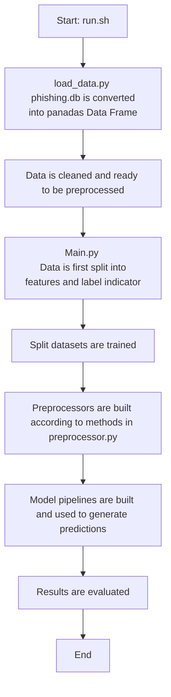

Name : SOH YONG KAI RYAN  \
Email : e1516774@u.nus.edu

## Overview of submission:
An End-To-End Machine Learning Pipeline (Data loading -> preprocessing -> Model Training/Evaluation)
An EDA python notebook that contains findings of given dataset
Requirement.txt for all required libraries
run.sh to execute the pipeline

Folder Structure:
AIIP/    \
├─ data/    \
│ └─ phishing.db  \
├─ src/    \
│ ├─ config.py    \
│ ├─ load_data.py   \
│ ├─ preprocessing.py   \
│ ├─ main.py   \
│ └─ init.py    \
├─ EDA.ipynb    \
├─ requirements.txt    \
└─ README.md

- "data/phishing.db" - Contains given dataset   
- "src/config.py" - Contains all parameters that are adjustable (
    DB_path, Table, Target,Numerical_cols, Categorical_cols, Numerical_Imputer_Strategy, Categorical_Imputer_Strategy, Test_Size, Random_State )   
- "src/load_data.py" - Loads data from db and cleans the data for processing    
- "src/preprocessing.py" - Makes preprocessor for the model    
- "src/main.py" - Trains and evaluates models

## Instructions for execution and modifying parameters:
Create and activate a python virtual environment and install requirements  \
Run the following command in bash    \
./run.sh

To modify parameters, access the 'src/config.py' file and update the respective parameters

Description of flow of the pipeline:

## Feature Processing Summary
Features         | Handle Missing           | Encoding     \
Numerical        | KNNImputer               | **RobustScaler(for linear models)
                                                /Standard Scaler (for Tree model)   \
Categorical      | SimpleImputer(most_freq) | OneHotEncoder

**Due to a large amount of outliers in Dataset robust scaler is used to prevent the larger values from significantly affecting the linearity of features

## Key Findings from EDA: (Quick summary)
- Dataset contains multiple numerical and categorical features.
- Data show some interesting observations namely the domain age mean of phishing websites are substantially higher than legitimate websites.
- Features such as IsResponsive, Robots.txt, NoOfExternalRef show a potentially strong relationship with a website legitimacy.
- All samples with null values for LineOfCode are legitimate websites.
- There is a small group samples with same features but opposing label indicators.

Choices made in the pipeline:
- Zeroed negative values of NoOfImage to ensure it does not affect models effectiveness
- Added a missing indicator for missing LineOfCode values for KNN imputation as they make up a  significant proportion of the dataset and dropping them would lead to a significant loss in data.

## Model Choices and reasoning:
- Logistic Regression
Easy to implement and train and has a strong baseline
It is very explainable as it is able to provide a measure of how good a predictor is, and its direction of association
Features are likely to have a linear relationship with the phishing indicator

- LinearSVC
Similar to Logistic Regression 
Used in order to further support the evidence that the features have a strong linear boundary

- ExtraTreesClassifier
Captures nonlinear interactions between features that linear models(like the ones used previously) cant. 
Model can learn nonlinear interactions across one-hot encoding and numerical features.

## Metrics Used:
- Precision: Among predicted phishing, how many are truly phishing.
- Recall: Among Truly phishing websites, how many are predicted correctly
- F1-score: harmonic mean of precision and recall   \
In phishing detection, number of false positives and false negatives matter a lot, hence these metrics provide a clearer picture than simply accuracy alone. 

## Evaluation of models:
- Linear models (Logistic Regression/LinearSVC) achieved similar results and are score pretty good.
- This indicates that the features are mostly linear where more feature == greater likelihood of phishing.
- Logistic Regression has fewer True Positive and False Positives than LinearSVC indicating that Logistic Regression has a stricter threshold on what it considers phishing
- ExtraTreesClass has significantly more False Positives than the other models indicating that features are less non-linear than it would like.

